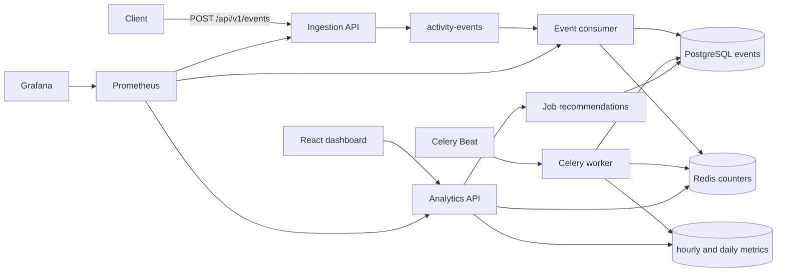

# PulseStream architecture

Kafka carries live activity. Celery runs on a clock. Redis holds rolling counters. PostgreSQL is the source of truth.

```
Client → FastAPI :8000 → Kafka activity-events
                              ↓
                         event consumer
                              ├── PostgreSQL events
                              └── Redis rolling counters (first store only)
                                        ▲
Analytics API :8001 ────────────────────┤
Dashboard :3000 ──proxy──► Analytics API
                              job recs ← users/jobs catalog + events
                                        │
Celery Beat → Celery worker ────────────┤
                              ├── hourly_metrics / daily_metrics
                              ├── daily_job_metrics
                              ├── scheduled_reports
                              ├── cleanup processed:event:*
                              └── recompute Redis from events

Prometheus :9090 scrapes :8000/metrics, :8001/metrics, consumer :8002/
Grafana :3001 reads Prometheus
```



## Kafka vs Celery

Kafka consumes a continuous stream of profile, feed, and job events.

Celery runs on a schedule:

- Hourly engagement summaries at minute 5
- Daily job-click reports at 00:15 UTC
- Failure reports at minute 10
- Idempotency and stale-window cleanup at minute 20
- Full Redis recomputation at 00:30 UTC

Interview line: Kafka handles continuous event streaming; Celery handles scheduled and administrative work.

## Job recommendations

Score is a weighted mix, not a model:

`0.50 * skill Jaccard + 0.30 * interaction similarity + 0.20 * popularity`

Interaction similarity uses the caller's clicks and saves, then users with overlapping job sets. Clicked and saved jobs are dropped from the result. `GET /api/v1/recommendations/jobs?user_id=user_001`

## Duplicate delivery

If the consumer writes PostgreSQL and crashes before the Kafka offset is committed, Kafka redelivers the event. The second pass does not insert another row and does not increment Redis.

Guards:

- `event_id` is a UUID and the PostgreSQL primary key
- Redis key `processed:event:{id}` with a 24-hour TTL
- Analytics counters run only on first store (`Outcome.STORED`)

If Redis is flushed, `recompute_aggregates` rebuilds counters from `events`. PostgreSQL remains the source of truth.

Malformed payloads go to `activity-events-dlq` and `failed_events` after validation failure. Transient store errors retry at 1s, 2s, then 4s before the dead-letter path.

## Observability

| Port | What it shows |
| --- | --- |
| `:3000` | Live analytics dashboard (polls `/api/v1/analytics/summary` every 3s) |
| `:3001` | Grafana operations dashboard (admin / admin) |
| `:9090` | Prometheus |
| `:8002` | Consumer process metrics |

Prometheus series include accepted events, processed outcomes, retries, dead letters, processing latency, database write latency, and consumer lag.

## Testing

Unit tests cover event validation, retry backoff, click-through rate, and job recommendation scoring.

Integration tests send a real event through FastAPI → Kafka → PostgreSQL → Redis and run the hourly Celery job.

Failure tests send malformed events to the dead-letter path, restart the consumer, and take PostgreSQL or Redis down to confirm accepted events are not lost and duplicates are not counted twice.

`event_generator` creates random users, posts, jobs, plus occasional duplicates and invalid payloads. Locust measures accepted events per second. Numbers live in `load_tests/BENCHMARK.md`.
